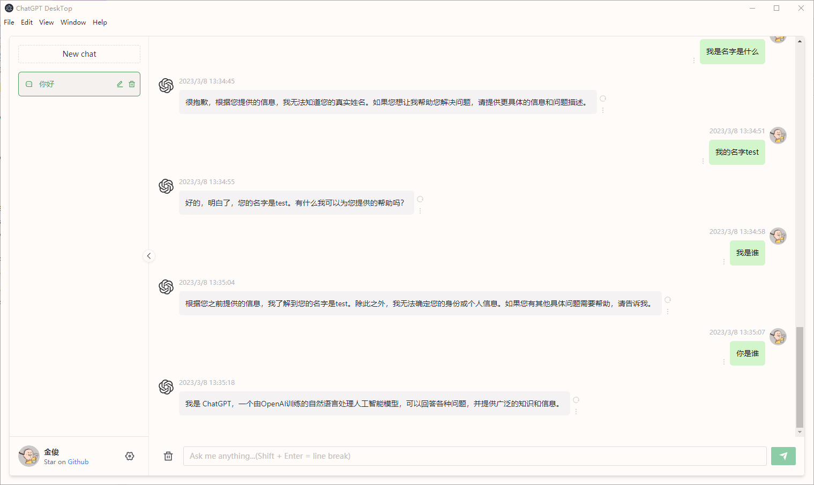

## 项目介绍

使用 chatgpt API ,速度比官方的 plus（20美元一个月） 还要快。
按量付费，费用很低，20美元1000万token(约500万汉字)。 

## 截图
]

## 使用说明

下载构建版本，填写 openAi 的key，直接运行即可。

中国用户，需要设置代理，否则无法访问 openAi 的api

### window用户：

点击 https://github.com/jinjun1994/ChatGPT-API-DESTOP/releases

下载 chatgpt-desktop-*.*.windows.zip

解压后，修改 .env 文件，

填写 openAi 的key，

以及代理的局域网地址和端口（仅中国用户需要），

然后双击运行 chatgpt-desktop.exe 即可

### mac 用户：

暂无 mac 电脑打包文件。

## Project Description
Using the chatgpt API is faster than the official plus ($20/month) version. The payment is based on usage, and the cost is very low, $20 for 10 million tokens (about 5 million Chinese characters).

## Screenshots
]

## Usage Instructions
Download the built version, fill in the OpenAI key, and run it directly.
For users in China, a proxy needs to be set, otherwise, OpenAI's API cannot be accessed.

### For Windows users:
Click https://github.com/jinjun1994/ChatGPT-API-DESTOP/releases

Download chatgpt-desktop-..windows.zip
After extracting, modify the .env file,
Fill in the OpenAI key,
As well as the LAN address and port of the proxy (only required for users in China),
Then double-click chatgpt-desktop.exe to run.

### For Mac users:
Currently, there is no packaged file for Mac computers.